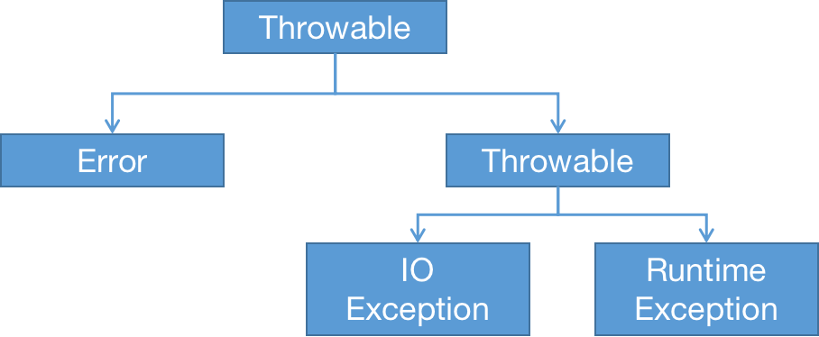
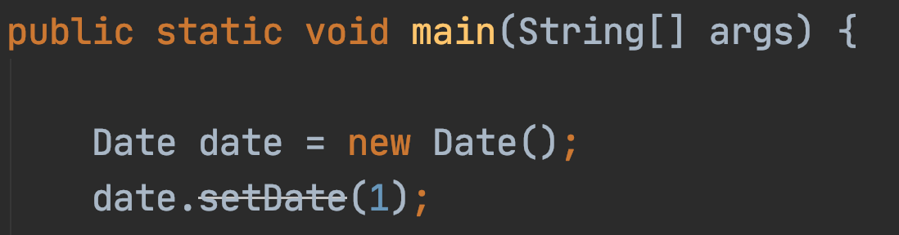
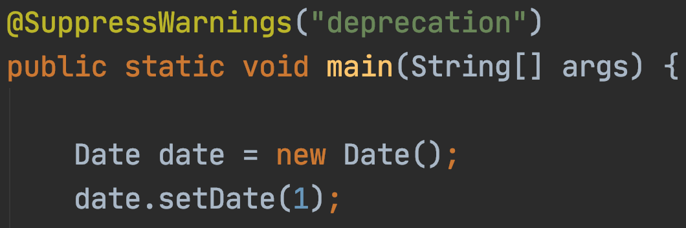
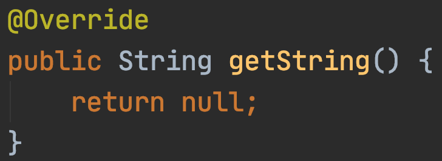
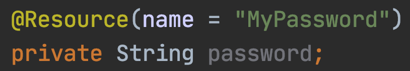

[TOC]

# OOP

## 一些细节

### Java的传参方式：传值

除了基础数据类型，变量保存的是对象的引用。当函数参数为对象时，指向对象的变量（对象的引用）`origin_val`被复制了一个新变量`functional_val`并用于函数内部操作，**这实际上就是传值**；复制的变量`functional_val`与原始变量`origin_val`指向的对象是一样的，因此对`functional_val`变量的操作会改变`functional_val`指向的对象的内容，造成外部看来`origin_val`被改变，貌似是传引用，实则不是。

### 重载 *overloading* 与覆盖 *override*

* 重载：相同函数名，不同参数
* 覆盖：子类重新实现父类的同名函数，调用父类方法时需要以`super.<父类函数>`的方式

### 类间关系

* 依赖 *uses-a*（耦合度，需要减少）
* 聚合 *has-a*
* 继承 *is-a*

## 相关关键字

### `final`

#### `final`字段（成员变量）

类中被`final`修饰的字段，在对象调用构造函数时进行初始化，以后也不会修改。

#### `final`类

类被`final`修饰，代表此类不允许被`extends`，所有方法自动成为`final`方法，但字段不一定是`final`字段。

#### `final`方法

类中方法被`final`修饰后，子类不能override这个方法。

### `static`

存在于类中，与类相关，与类实例化出的具体对象无关。

#### `static`字段（成员变量）

类中被`static`修饰的字段，在这个类的所有实例化对象中共享这个字段的数据，属于类而不是某个具体实例化的对象。

#### `static`常量

结合`static`与`final`，打造一个类的实例化全部对象共享但不可改变的唯一常量。

```java
public static final double PI = 3.14;
```

#### `static`方法

不作用在某个具体对象上，没有`this`参数，只能访问被`static`修饰的字段。常用在与某个具体对象本身无关的方法上。

```java
class Test {
    public static int staticVar = 1;
    public static int getStaticVar() {
        return staticVar;
    }
}

// 调用示例
Test.getStaticVar();
```

### 代码块

#### `{}`代码块

在加载类时、Constructor执行之前执行，按定义顺序执行；`new`一次新实例就执行一次。

#### `static {}`代码块

加载时间、顺序与非静态代码块相同；只在第一次`new`实例时执行一次。

#### 各种代码块执行顺序

**代码[在此](https://github.com/AlbertoWang/java-noob/blob/master/src/cn/albertowang/lang/block/CodeBlock.java)**

1. `new`实例的顺序：静态代码块 -> 非静态代码块 -> 构造函数

2. 无`new`的顺序：静态代码块 -> 方法 -> 方法中的代码块

## 继承

### `extends`

```java
public class Son extends Father {}
```

父类（超类 *superclass*、基类 *base class*），子类（派生类 *derived class*）；在实现子类的Constructor时候，需要先调用父类的Constructor。

```java
public Son() {
    super();	// 调用父类的Constructor，不写的话默认父类无参Constructor
}
```

### 重写`equals`方法

为了检测一个对象是否与另一个对象相同，需要重写（覆盖）Java万物起源`Object`中的`equals`方法；

#### `equals`规范特性

* 自反性：`x.equals(x)`为`true`
* 对称性：当且仅当`x.equals(y)`为`true`,`y.equals(x)`为`true`
* 传递性：`x.equals(y)`为`true`且`y.equals(z)`为`true`，则`x.equals(y)`为`true`
* 一致性：`x`与`y`引用的对象不变时，`x.equals(y)`结果永远一致
* 非空性：非空引用`x`永远有`x.equals(null)`为`false`

#### `equals`的实现

为了满足以上规范特性，实现`equals`的流程如下：

```java
@Override
public boolean equals(Object otherObject) {
    // 1. 检测引用的是否为同一个对象
    if (this == otherObject)
    	return true;
    
    // 2.检测对比目标是否为空引用
    if (otherObject == null)
    	return false;
    
    // 3.考虑相等的定义（以下二选一）
    //   1)相等的定义在子类中会改变，则类不同就不同
    if (getClass() != otherObject.getClass())
    	return false;
    //   2)相等的定义在子类中不会改变，则判断是否是同源类
    if (!(otherObject instanceof <ClassName>))
    	return false;
    
    // 4. 强制转换类型并逐个字段比较
    <ClassName> other = (<ClassName>) otherObject;
	return <basicTypeField>==other.<basicTypeField> && Objects.equals(<classTypeField>, other.<classTypeField>)...;
}
```

## 抽象

### `abstract`

抽象类才可以包含抽象方法，且在被继承时必须实现这些抽象方法；

尽管抽象类不能被实例化出一个对象，但可以提供具体方法用于被继承；

如果抽象方法没有被全部实现，则该子类也必须被`abstract`修饰成为抽象类。

```java
public abstract class Person {
    private String name;						// 字段
    public getName() {return name;}				// 具体方法
    public Person(String name) {this.name = name;}
    public abstract String personFunction();	// 抽象方法
}
```

### `interface`

接口不是类，是对符合这个接口的类的一系列需求，因此不能实例化；

一个类可以实现（`implements`）多个接口来达到多继承的目的，而抽象类只能被单继承；

如果在接口中需要提供默认方法实现，可以使用`default`，如下：

```java
public interface Comparable<T> {
    default int compareTo(T other) {
        return 0;
    }
}
```

### 抽象类与接口的异同

* 相同点：

  1. 不能被实例化

  2. `interface`的实现与`abstract`的子类必须实现了方法才能被实例化

* 不同点：

  1. `interface`除非有`default`否则不允许实现方法；`abstract`中可以实现
  2. 类可以实现多个`interface`；但只能继承一个`abstract`
  3. `interface`强调功能实现；`abstract`强调所属关系
  4. `interface`中字段默认为`public static final`且必须赋值，不能被修改；`abstract`中字段可以被修改，但不能包含`private`、`static`、`synchronized`、`native`等

## 多态

变量声明时可以使用父类，实例化时可以使用子类，反过来不行；在使用多态时，变量类型相当于不起作用，根据引用对象来决定实际上的变量类型。

```java
// 向上兼容
Father father = new Son();			// ok
Father father = (Father) new Son()	// ok
// 向下不兼容
Son son = new Father()				// 编译错误
Son son = (Son) new Father()		// 运行错误
```

# 范型

## 范型相关定义

### 范型类

使用`<>`将范型变量标出：

```java
public class MyClass<T, U> {
    // 同时使用两种范型变量
    private T first;
    private U second;
}
```

### 范型方法

范型变量放在修饰符（`public`或`static`等）之后：

```java
public static <T> T methodName(T t) {
    // 返回T范型
    return t;
}
```

### 范型变量限定

如果需要确保范型变量具有某个方法（比如`Comparable`接口中的`compareTo`），需要在范型变量后添加`extends <FirstInterfaceName> & <SecondInterfaceName>`修饰限定：

```java
public static <T extends Comparable & Serializable> MyClass<T> methodName(T t) {
    // T范型变量同时继承了Comparable与Serializable接口
    // 同时继承多个接口的时候，没有方法的接口放在限定列表的末尾
    return new MyClass<>(t);
}
```

## 关于范型的约束

### 范型类型的擦除

JVM没有范型类型的对象，因此在编译时，范型类型会被擦除，变成其限定类型（没给出限定类型则成为`Object`）：

```java
public class MyClass {
    // 被擦除的范型变量
    private Object first;
    private Object second;
}
```

### 范型类型的限制

#### 不能实例化范型类型变量

由于范型类型会被擦除，`T t = new T()`的写法就是不合法的。但是可以通过函数式接口`Supplier<T>`表示一个无参数且返回类型为`T`的方法：

```java
public static <T> MyClass<T> constructMyClass(Supplier<T> supplier) {
    return new MyClass<>(supplier.get());
}
```

使用时候可以`MyClass<String> m = MyClass.constructMyClass(String::new)`。

#### 不能构造范型数组

## `Optional`类型

`Optional<T>`是一种包装器（wrapper），要么包装了类型`T`的对象，要么没包装任何对象，这是一种更安全的替代类型`T`的引用：这种引用要么是对应类型`T`的对象，要么是`null`；`Optional`类型支持流`Stream`中定义的多种操作，如`map`或`filter`。

### 包装内容的创建

* `of(T value)`：包装对象`value`，如果对象为`null`抛出异常；
* `ofNullable(T value)`：作用同上，但不会抛出异常，而是产生空的包装器；
* `empty()`：创建空的包装器。

### 包装内容的获取

* `orElse(T other)`：获取包装器里的值，如果为空则产生一个类型为`T`的`other`对象；
* `orElseGet(<lambda表达式/方法引用>)`：作用同上，但`other`的来源使用提供的方法产生；
* `orElseThrow(<Exception的new方法引用>)`：作用同上，但不产生对象，直接抛出异常。

### 包装内容的处理

* `ifPresent(<lambda表达式/方法引用>)`：对包装器里的值直接调用方法进行操作；
* `map()`/`filter()`：与`Stream`中的作用相同；
* `flatMap()`


# 异常与日志

## 异常

Java中异常对象派生于`Throwable`类，层次结构如下



* `Error`：系统内部错误、资源耗尽
* `RuntimeException`系列：错误的强制类型转换、数组越界（`ArrayIndexOutOfBoundsException`）、访问`null`（`NullPointerException`）
* 非`RuntimeException`系列：读取文件越过尾部、打开不存在的文件、类不存在

# 集合框架

## Java集合框架及其实现

集合类实现的是`Collection`接口，实现了Interface与Implementation分离。集合类里面包含了一个重要的方法：迭代器`Iterator`。

* 使用迭代器遍历

  * 先使用`iterator.hasNext()`确定有元素，再`iterator.next()`。
  * lambda表达式：`iterator.forEachRemaining(element -> do...)`。

* 使用迭代器删除

  删除的是上次调用`.next()`时返回的元素，且删除相邻元素时需要调用`.next()`再进行`.remove()`。

  ```java
  // 使用iterator删除相邻元素
  iterator.remove();
  iterator.next();
  iterator.remove();
  ```

## List

### `LinkedList` 双向链表

使用链表数据结构，无法真正随机访问，适用于快速插入、删除元素。

#### 基本操作

* **删除元素**

  使用 `Iterator<E> iterator = linkedList.iterator()`进行`iterator.remove()`。

  调用删除时需要注意，双向链表调用`iterator.next()`后的`iterator.remove()`删除的是`iterator`位置<u>左侧</u>的元素；调用`iterator.previous()`后的`iterator.remove()`删除的是`iterator`位置<u>右侧</u>的元素（`iterator`相当于一个光标）。

* **增加元素**

  使用`ListIterator<E> iterator = linkedList.listIterator()`进行`iterator.add(e)`。

  添加的位置是`iterator`位置的<u>左侧</u>。

* **修改元素**

  使用`ListIterator<E> iterator = linkedList.iterator()`进行`iterator.set(e)`。

  替换的位置是最近一次的`iterator.next()`或`iterator.previous()`的元素，若连续修改同一个元素会抛出`IllegalStateException`异常。

#### 关于线程安全

如果使用了`iterator.remove()`，再被访问时会被抛出`ConcurrentModificationException`异常（外部修改）；而`iterator.set()`方法对集合中值的修改不被视为<u>结构性</u>修改，这样的多线程修改不会抛出异常。

#### 关于类库优化

`linkedList.get(idx)`方法优化：作为一个虚假的随机访问，如果`idx`>`linkedList.size()/2`，则从尾部反向搜索。

### `ArrayList` 数组列表

#### 关于`ArrayList`与`Vector`的选择

使用`ArrayList`而不是`Vector`的原因：`ArrayList`所有方法是<u>线程不安全</u>的，`Vector`所有方法是<u>同步的</u>（线程安全），`Vector`在单线程情况下开销较大。

### `Queue` 队列，`Deque` 双端队列

尾部添加，头部删除的数据结构；头部尾部都可添加/删除的数据结构。

#### 基本操作

* 添加元素

  如果队列已满，`queue.add(e)`会抛出`IllegalStateException`异常，`queue.offer(e)`不会，只返回`false`。

* 删除元素

  如果队列为空，`queue.remove(e)`会抛出`NoSuchElementException`异常，`queue.poll(e)`不会，只返回`null`。

* 获取队头

  如果队列为空，`queue.element()`会抛出`NoSuchElementException`异常，`queue.peek(e)`不会，只返回`null`。

`Deque`的方法在前面`Queue`方法后面加入`First`或`Last`表明头尾位置即可。

#### 关于类库实现细节

`ArrayDeque`初始容量为<u>16</u>。

### `PriorityQueue` 优先队列

使用堆（自组织二叉树，root为最小值）的数据结构，按任意顺序插入元素，按有序检索，每次`priorityQueue.remove()`删除的都是最小的元素；指定了`Comparator`即可自定义排序；

适用于任务调度，值越小优先级越高。

## `Set`

### `HashSet` 散列集， `Hashtable` 散列表

使用散列表数据结构，用于快速找到元素，不在意元素顺序。

#### 关于再散列

散列表的装填因子*load factor*用来表示自动再散列阈值（默认0.75，当元素填满了75%以上则会再散列，桶数翻倍）。

#### 关于类库优化

`Hashtable`使用链表（图中右侧链表）来维护一个桶*bucket*（白块与链表的集合），桶满时会使用<u>二叉树</u>提高性能；

桶的大小为预计元素个数的<u>75%~150%</u>，<u>默认为16</u>，桶数为2的幂。

### `TreeSet` 树集

#### `TreeSet`与`HashSet`的区别

与`HashSet`类似，数据结构使用<u>红黑树</u>，因此遍历时是有序的集合；由于包含了比较过程，需要实现`Comparable`接口或提供`Comparator`。

## Map

### `HashMap`

`HashMap`线程不安全，元素的key最多允许一个`null`，元素的value可以有多个`null`，无法保证元素顺序，初始容量为<u>16</u>；扩展容量时采用<u>头插</u>节点方式（造成的结果是每次扩容元素逆序一次，多线程时可能产生环链）。

### `LinkedHashMap`

`LinkedHashMap`是`HashMap`的子类，记录了元素插入顺序，因此使用`iterator`时是按插入顺序遍历的。

### `HashTable`

`HashTable`线程安全，元素的key或value都不允许为`null`可以多线程共享，更好的替代是`ConcurrentHashMap`。

### `TreeMap`

`TreeMap`实现了`SortMap`接口，使用红黑树数据结构，默认根据key的升序排列元素，即元素有顺序。

### `Map`部分总结

|            |           HashMap           |        TreeMap        |
| :--------: | :-------------------------: | :-------------------: |
|  数据结构  |         Hash散列表          |        红黑树         |
|  数据顺序  |          随机顺序           |        key升序        |
|  性能损耗  |           基本无            |    插入、删除过程     |
| key与value | 允许一个key:value=null:null | key:value都不允许null |
|  线程安全  |           不安全            |        不安全         |

#### 关于遍历速度

`HashMap`遍历速度与容量有关，`LinkedHashMap`遍历速度与数据量有关；

`HashMap`对key散列映射，`TreeMap`根据key组织搜索树，前者更快，后者排了顺序。

遍历`HashMap`的几种方式：

* `forEach`的lambda表达式

  ```java
  hashMap.forEach((k, v) -> {doSomething(k, v);});
  ```
  
* 按`Entry`遍历

  ```java
  for(Map.Entry<Object, Object> entry : hashMap.entrySet()){
      doSomething(entry.getKey(), entry.getValue());
  }
  ```

* 按key遍历

  ```java
  for(Object key : hashMap.keySet()) {
      doSomething(key);
  }
  ```

* 按value遍历

  ```java
  for(Object value : map.values()) {
      doSomething(value);
  }
  ```

  

#### 关于hash冲突

`HashMap`由`Entry`组成的数组（桶）构成；当`Entry`的hash code冲突时，同一个hash code下再用链表构成，元素插入是**头插入**，默认长度**16**，自动扩展时长度为**2的幂**（为了hash后减少碰撞）；冲突**链表长度>8**时，后面的数据保存在**红黑树**中。


#### `HashMap`的`loadFactor`为什么是0.75

在空间与时间上折衷，`loadFactor`大了会降低空间开销但是增加查找成本。由于**泊松分布**，0.75碰撞最小。

# Java 多线程

## 问题的出现

Java多线程的问题，是由Java虚拟机的内存模型（Java Memory Model，JMM）引起的：由于线程对共享变量的修改可能无法及时更新到主存，其他线程在使用共享变量时，该共享变量中保存的可能不是最新的值。

**代码[在此](https://github.com/AlbertoWang/java-noob/blob/master/src/cn/albertowang/concurrent/plain/NonSyncThread.java)**

以上代码仅仅在`thread.start()`调用`run()`方法时会输出一句，虽然`thread.flag`为`true`，但`main`主线程没有检测到`thread.flag`的变化，对于`main`线程来说，`thread.flag`仍然是`false`，这就是多线程情况下的内存不可见性。

## 线程处理

### 安全结束线程

使用`t.interrupt()`方法中断线程，同时在线程重写的`run()`中判断`Thread.currentThread.is Interruptted()`来安全退出线程。

## 线程同步方法

|          |                            互斥锁                            |                           内存可见                           |                             COW                              |                             CAS                              |
| :------: | :----------------------------------------------------------: | :----------------------------------------------------------: | :----------------------------------------------------------: | :----------------------------------------------------------: |
| 具体体现 |     `synchronized`，<br />`java.util.concurrent.locks.*`     |                          `volatile`                          | `java.util.concurrent`<br />`.ConcurrentHashMap`<br />`/CopyOnWriteArrayList`等 | `java.util.concurrent`<br />`.atomic.*`，<br />`java.util.concurrent.locks.*` |
| 底层实现 | 线程加锁，从主存拷贝副本，修改后的副本刷新到主存，释放锁<br />底层调用了CAS | 从主存拷贝副本，修改后的副本刷新到主存，其他线程可以知道该变量被修改过 | 从主存拷贝副本，修改后的副本刷新到主存；<br />具体实现中，val与next指针被`volatile`修饰；底层存储数据的tab是用来CAS | 变量修改前和主存中的对比，如果不同就更新，否则进行操作；<br />底层CPU原语提供支持 |
|  原子性  |                              有                              |                              无                              |                              有                              |                              有                              |
|  可见性  |                              无                              |                              有                              |                              无                              |                              无                              |

### Java关键字

#### `synchronized`关键字

使用`synchronized`关键字对线程或变量加锁，在修改一个线程的内存中的信息时会加锁防止其他线程进行操作，修改完毕后解锁，其他线程才可见。

**代码[在此](https://github.com/AlbertoWang/java-noob/blob/master/src/cn/albertowang/concurrent/plain/SynchronizedThread.java)**

##### `synchronized`关键字原理

1. 使用`synchronizer`关键字给线程加锁；
2. 当线程**获取到锁**后，该线程清空本地内存并从主内存拷贝共享变量的最新值作为副本；
3. 将修改后的副本再**刷新到主内存**中；
4. 线程释放锁，在此之前其他线程无法使用被加锁的共享变量。

##### 可重入锁

* 定义：当一个线程获取了某个变量的锁后，如果该线程再次对这个变量加锁是允许的，其他线程不允许；

* 实现方式：

  锁关联了持有者标签和计数器，当计数器为0时，任何线程都可以竞争该锁；

  当计数器大于0时，JVM记录下持有锁的线程，如果该线程继续请求锁，计数器++，如果其他线程请求锁，由于计数器非0，需要等待。

#### `volatile`关键字

使用`volatile`关键字修饰共享变量，在修改共享变量时，其他线程也会检测到变量的修改。

**代码[在此](https://github.com/AlbertoWang/java-noob/blob/master/src/cn/albertowang/concurrent/plain/VolatileThread.java)**

##### `volatile`关键字原理

1. 被`volatile`关键字修饰的共享变量，当线程操作它时，从主内存拷贝该变量的最新值作为副本；
2. 线程操作副本并写回主内存后，通过**CPU总线嗅探机制**告知其他线程该共享变量被修改过，需要重新从主内存读取（对外看起来似乎是直接操作了主内存中的变量，故称**内存可见**）。

##### `volatile`关键字注意点

###### CPU总线嗅探机制：

* 概念：为了实现缓存一致性的机制，由多缓存引起（不是由多核CPU引起，这一点与JMM的同步问题类似）。

* 工作原理：每个处理器（线程）监听总线上传播的数据（主内存）来检查自己缓存（本地内存）的值是否已经过期；如果监听到了修改，会重新将数据存储到缓存（本地内存）中。

###### 指令重排序

* `volatile`保证了共享变量一致性的同时，禁止了指令重排序优化（使用**内存屏障**实现），保证了被`volatile`修饰的共享变量在编译后执行的顺序与代码顺序相同。

* 防止指令重排序的办法可以应用到单例设计模式中，避免单实例对象还没完成`new`的全部原子操作就被其他线程占用。代码可以参见[单例设计模式](https://github.com/AlbertoWang/java-noob/tree/master/src/cn/albertowang/designpattern/singleton)部分。

#### `synchronized`与`volatile`的选择

##### 选择`synchronized`的情况

* 运算结果依赖了共享变量某一时刻的值；
* 多个线程同时对共享变量进行修改（总线嗅探机制无法应对多线程同时修改的情况）；
* 需要满足原子性：多个共享变量需要保证同时同步。

##### 选择`volatile`的情况

* 尽量避免使用`volatile`；
* 对共享变量的写入不依赖于某个时刻该值的状态（总线嗅探机制无法应对多线程同时修改的情况）；
* 保证单个线程对共享变量进行修改（同上）。

### 重量级锁、悲观锁

#### `Lock`接口


### 轻量级锁、自旋锁、乐观锁

#### 写时复制 Copy On Write，COW

需要对数据修改时，将原数据复制一个备份，并在这个备份上进行修改操作（整个修改过程其他线程不知道这个备份）；当修改完成时，修改后的数据备份与原数据进行交换，其他线程才会察觉到修改。

具体体现：`ConcurrentHashMap`、`ConcurrentLinkedQueue`、`CopyOnWriteArrayList`和`CopyOnWriteSet`。

#### 比较并交换 Compare And Swap， CAS

JVM底层实现使用了CPU原语中的锁来保证原子性，没有调用操作系统，因此是轻量级锁。

具体体现：`Atomic`类

ABA问题

* 定义：初始值A，被改为B又改回A，对外不知道A被改过了；
* 解决：使用一个修改过就会改变的版本号，在对比值的同时还要对比版本号。

#### 抽象队列同步器 Abstract Queued Synchronizer，AQS

具体讲解可以参照[这里](https://zhuanlan.zhihu.com/p/86072774)。

AQS主要用于`ReentrantLock`等。

### 偏向锁

`new`的实例自带匿名偏向锁；不需要竞争锁，速度较快；在使用变量前修改变量的标志位，说明变量有线程在使用。

#### 偏向锁的升级

如果有线程调用此被使用的变量，偏向锁升级为轻量级锁（不等待，消耗资源）；

如果轻量级锁等待的线程太多（超过核心数一半）或锁被长时间占用（等待的线程超过10次自旋），轻量级锁升级为重量级锁（进入队列等待，不消耗资源）。

### JVM相关

对象的大小包括了*markword*（包括了锁、GC的分代年龄、hashcode等，8字节）、*class pointer*（说明指向哪个class）、*instance data*（字段的大小）、*padding*（将整个对象大小补齐到8的整数倍）

# Java 反射机制

## 注解 Annotation

### 注解的使用场景

注解的价值体现在Java反射过程中，具体实现包括：

* 文件自动生成，如bean等
* 测试、日志、事务等代码自动生成
* 框架编写（比如使用JUnit4工具调用所有被特定注解`@Test`标注的方法）

### 注解的创建

使用`@interface`声明注解，如：

```java
public @interface MyAnnotation {
    String value() default "DefaultValue";
}
```

* 如果注解的元素有`value`且没有其他元素/其他元素都有`default`的值，则在使用该注解的时候可以忽略掉`value =`：上面的注解可以直接以`@MyAnnotation`或`@MyAnnotation("GivenValue")`调用，不需要`@MyAnnotation(value = "GivenValue")`；

* 注解的元素不支持`null`，如果有需要只能使用默认值为`""`或`Void.class`；

* 注解不支持循环依赖：注解A包含了注解B为元素，注解B又包含注解A为元素的情况是不允许的。

### Java给出的标准注解

|      注解名       |                作用位置                |                             作用                             |                             示例                             |
| :---------------: | :------------------------------------: | :----------------------------------------------------------: | :----------------------------------------------------------: |
|    Deprecated     |                  全部                  |       将被标注的东西标记为不支持的，在IDE中就可以显示        |  |
| Suppress Warnings | 除了PACKAGE与ANNOTATION_TYPE的其他位置 |   将被标注的位置的某个Warning信息屏蔽掉，在IDE中就可以显示   |  |
|     Override      |                 METHOD                 | 检查该方法是否覆盖了父类方法，在实现接口的时候IDE会自动添加  |  |
|    Documented     |            ANNOTATION_TYPE             |                  说明该注解被包含在javdoc中                  |                                                              |
|     Resource      |              TYPE，FIELD               | 在TYPE情况下标记为其他地方会使用到的资源，在FIELD情况下用来注入资源 | 注入资源 |
|      Target       |            ANNOTATION_TYPE             |                  说明该注解可以用到什么位置                  | 见[代码](https://github.com/AlbertoWang/java-noob/tree/master/src/cn/albertowang/reflection/annotation) |
|     Retention     |            ANNOTATION_TYPE             |                         注解生命周期                         | 见[代码](https://github.com/AlbertoWang/java-noob/tree/master/src/cn/albertowang/reflection/annotation) |
|     Inherited     |            ANNOTATION_TYPE             |  声明被标注的类的子类仍保留此注解，仅限类继承，接口等都不行  | 见[代码](https://github.com/AlbertoWang/java-noob/tree/master/src/cn/albertowang/reflection/annotation) |

* `Target`（注解作用位置）的参数保存在*java.lang.annotation.ElementType.java*中，包含了以下几种：

  ```java
  public enum ElementType {
      /** Class, interface (including annotation type), or enum declaration */
      TYPE,	// 类、接口、枚举
      /** Field declaration (includes enum constants) */
      FIELD,	// 字段
      /** Method declaration */
      METHOD,	// 方法
      /** Formal parameter declaration */
      PARAMETER,		// 形参
      /** Constructor declaration */
      CONSTRUCTOR,	// 构造函数
      /** Local variable declaration */
      LOCAL_VARIABLE,	// 局部变量
      /** Annotation type declaration */
      ANNOTATION_TYPE,// 注解类型
      /** Package declaration */
      PACKAGE,		// 包
      /**
       * Type parameter declaration
       * @since 1.8
       */
      TYPE_PARAMETER,
      /**
       * Use of a type
       * @since 1.8
       */
      TYPE_USE
  }
  ```

* `Retention`（注解生命周期）的参数保存在*java.lang.annotation.RetentionPolicy*中，包含了以下几种： 

  ```java
  public enum RetentionPolicy {
      /**
       * Annotations are to be discarded by the compiler.
       */
      SOURCE,		// 不包含在类文件，编译阶段会失效
      /**
       * Annotations are to be recorded in the class file by the compiler
       * but need not be retained by the VM at run time.  This is the default
       * behavior.
       */
      CLASS,		// 不被虚拟机载入，在运行阶段会失效
      /**
       * Annotations are to be recorded in the class file by the compiler and
       * retained by the VM at run time, so they may be read reflectively.
       *
       * @see java.lang.reflect.AnnotatedElement
       */
      RUNTIME		// 被虚拟机载入，可以通过反射API获取
  }
  ```

### 使用注解与反射生成代码

# Java8 流编程

## 基本介绍

处理集合中的元素时，常迭代遍历元素，采用流编程方式可以更关注于**做什么**而不是怎么做。流编程不存储任何元素，也不会对数据源进行修改，每次操作尽可能是惰性执行（不到需要结果的时候不执行操作）。

## 常用流操作

### 流的操作

* `stream()`/`parallelStream()`：在集合中产生流/并行流；
* `Stream.of()`：用已有元素作为参数创建流；
* `Stream.generate()`：创建流；
* `Stream.iterate()`：迭代生成序列；
* `filter(Predicate<? super T> predicate)`：产生符合断言中全部元素的流；
* `map(<lambda表达式/方法引用>)`：对流中的元素进行操作；
* `skip()`：跳过前n个元素；
* `limit()`：保留前n个元素，不够就提前结束；
* `distinct()`：保证元素的唯一性；
* `concat()`：合并两个流，第一个流应当是有限流。

具体使用可以见[代码]()

### 流的约减

相当于从数据流中得到最终结果，有点类似于SQL查询。

* `count()`：流中元素个数计数；
* `max(Comparator<? super T> comparator)`/`min(Comparator<? super T> comparator)`：根据比较器返回元素；
* `findFrist()`/`findAny()`：获取流的第一个/任意一个元素；
* `anyMatch()`/`allMatch()`/`noneMatch()`：元素匹配作为参数的`Predicate`对象时返回`true`；
* 

# JVM

# Spring

## Spring测试

使用MockMvc框架。

### Spring单元测试

使用Mock环境进行单元测试：

```java
@RunWith(SpringRunner.class)
@WebMvcTest(Controller.class) // 待测试controller
public class ControllerTest {
    @Autowired
    private MockMvc mvc;
    @MockBean
    private Service service;
    
    @Test
    public void test() throws Exception {
        Mockito.when(service.method().thenReturn());
    }
}
```

### Spring集成测试

启动了真实的Spring环境进行集成测试：

```java
@RunWith(SpringRunner.class)
@SpringBootTest(class = Application.class) // starter类
@AutoConfigureMockMvc
public class SpringTest {
    @Autowired
    private MockMvc mvc;
    
    @Test
    public void test() throws Exception { // 不符合matcher的预期抛出异常
        ResultActions resultActions = mvc.perform(MockMvcRequestBuilders.get("测试URL"));
        resultActions.andExpect(MockMvcResultMatchers.status().isOk()); // HTTP状态码
        resultActions.andExpect(MockMvcResultMatchers.content().json("应当的返回结果"));
        resultActions.andDo(MockMvcResultHandlers.print()); // 输出结果
    }
}
```

