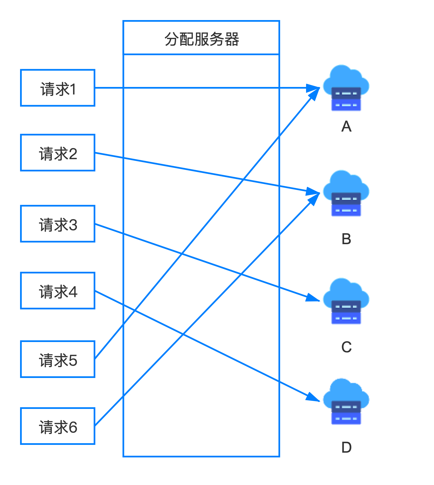
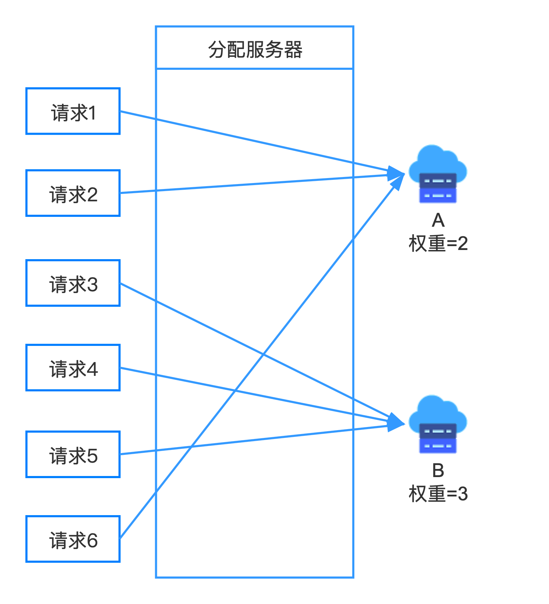
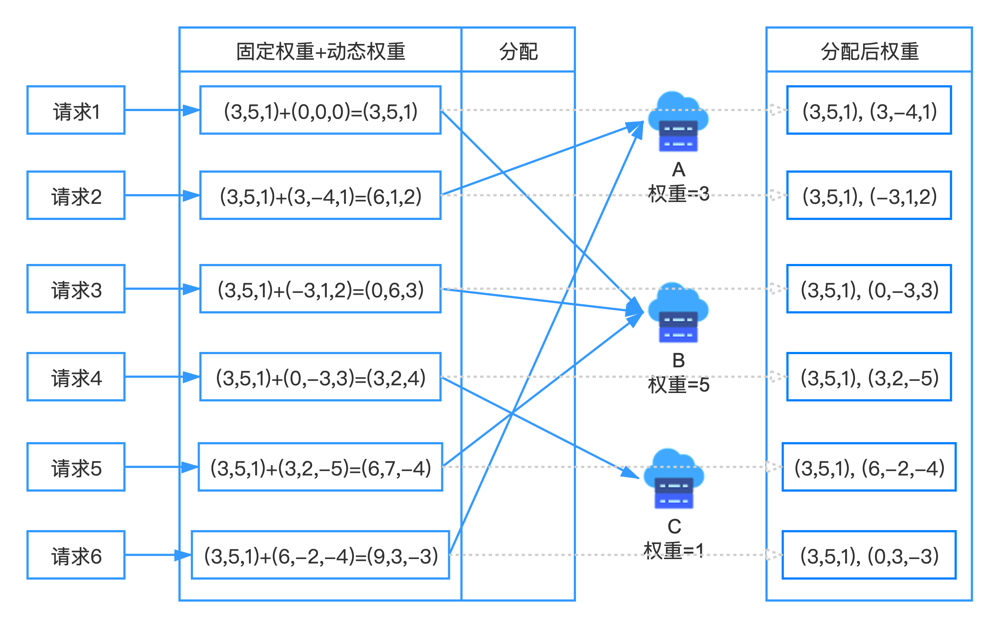
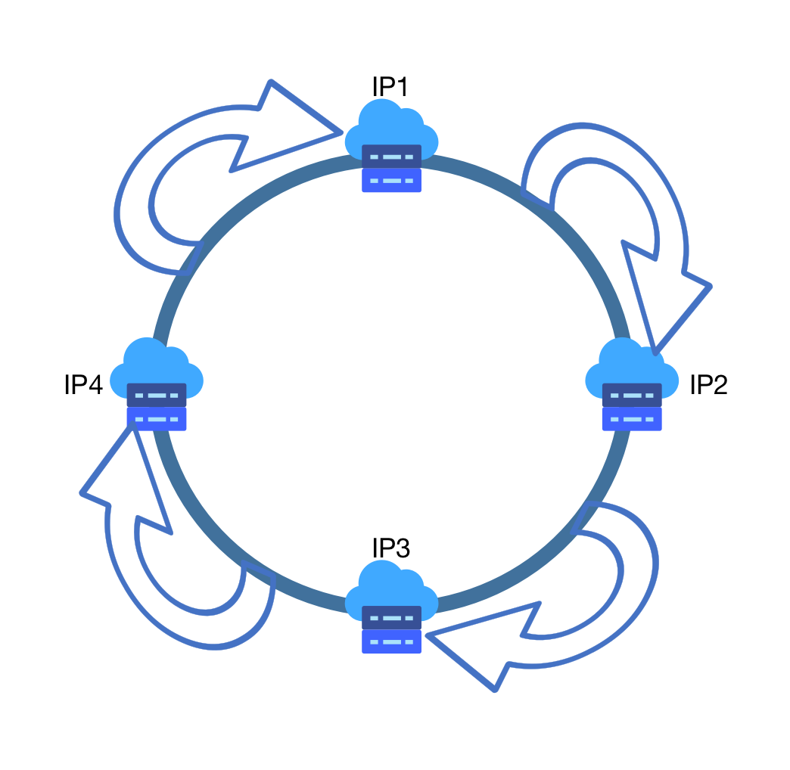
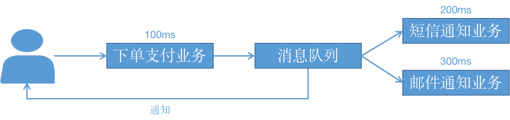
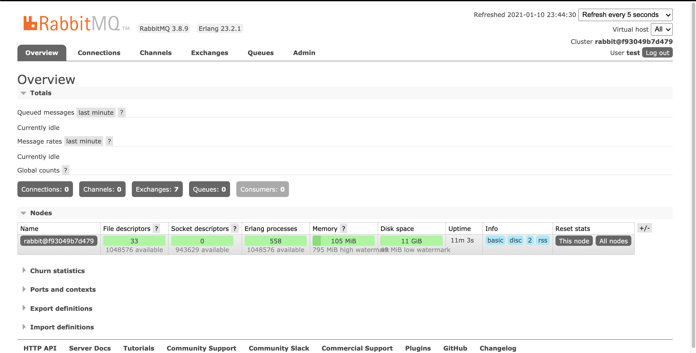

[TOC]

# 服务注册与发现、服务调用

## 相关框架及其联系

|   名称    | 提供者及目前状态 |                 定位                 |                             特性                             |
| :-------: | :--------------: | :----------------------------------: | :----------------------------------------------------------: |
|  Ribbon   |     Netflix      | IPC（Inter-Process Communication）库 | 负载均衡、容错、异步和响应式模型中支持多种协议（HTTP, TCP, UDP）、有caching和batching |
|   Feign   | Netflix（停更）  |   RPC（Remote Procedure Call）框架   | 消费端调用远程服务，简化http调用，内置Ribbon，不支持Spring MVC注解，基于http协议不适合高并发 |
| OpenFeign |      Spring      |                 同上                 |           Spring扩展版Feign，支持了Spring MVC注解            |
|   Dubbo   |     Alibaba      |                 同上                 |                 基于Netty，长连接适合高并发                  |
|  Eureka   | Netflix（停更）  |                                      |                                                              |
|   Nacos   |     Alibaba      |                                      |                                                              |

## 负载均衡

### 负载均衡策略

#### 基于随机的负载均衡

##### 完全随机

最简单的负载均衡，倒霉的情况下可能都压在一个服务器上。

##### 加权随机

为不同服务器添加权重，权重大的被随机到的概率大。

##### 改进加权随机

同样每个服务器带权重，随机一个随机数，从第一个服务器遍历直到找出一个权重大于等于随机数的服务器。

#### 基于轮询的负载均衡

##### 轮询 *Round Robin*

收到的请求循环分配到集群中的每台机器。



* 优点：简单有效；
* 缺点：如果每台机器性能不均，性能差的机器会超载。

##### 加权轮询 *Weighted Round Robin*



为不同机器分配权重，按权重分配给机器任务，任务有可能都到达同一个机器。如A的权重为3，B的权重为2的情况下：A -> A -> A -> B -> B -> ...。

* 优点：解决了轮询方式弱者超载的缺陷；
* 缺点：一定时间内的连接数无法确定，可能出现连接较少但超载的情况（比如连接处理时间较长）。

##### 平滑加权轮询 *Smoothed Weighted Round Robin*

在加权轮询$w_i$的基础上，添加动态权重$w'_i$，初始所有机器动态权重$w'_i=0$；当来了请求后按固定权重与动态权重之和寻找机器$i=\mathop{\arg\max}\limits_{i}(w_i+w'_i)$，并把选中机器的动态权重修改为当前动态权重与固定权重和之差$w'_i=w'_i-\sum{w_j}$，同时将全部机器的动态权重调整为$W'=W'+W$。



#### 基于连接数的负载均衡

##### 最小连接数 *Least Connection*

为了解决连接少但耗时长的请求，可以通过检测每个机器的当前连接数来分配任务，连接数最少的会自动接收下一个任务。

##### 加权最小连接 *Weighted Least Connection*

同时借鉴了权重与连接数的优势来实现负载均衡。

#### 源IP哈希/一致性哈希 *Source IP Hash*

对于来自同一个客户端的请求，通过对源IP进行求HashCode来达到同一个客户端的请求分配到固定服务器的目的。但这种方式也有可能造成资源分配不均（某个请求大户一直在发请求，但只有一个机器能应答）。

为了避免HashCode计算范围过大，可以采用哈希环的方式：哈希值在$[IP1,IP2)$时选择IP2服务器，哈希值在$[IP2,IP3)$时选择IP3服务器，哈希值在$[IP3,IP4)$时选择IP4服务器，哈希值在$[IP4,IP1)$时选择IP1服务器；当哈希环中有节点失效时，可以在失效节点内添加虚拟节点再把哈希环平分到几个节点。



### 不同框架下的负载均衡

#### Ribbon/Feign/OpenFeign

```yaml
ribbon:
  NFLoadBalancerRuleClassName: com.netflix.loadbalancer.RandomRule # 随机
  NFLoadBalancerRuleClassName: com.netflix.loadbalancer.RoundRobinRule # 轮询
  NFLoadBalancerRuleClassName: com.netflix.loadbalancer.RetryRule # 重试
  NFLoadBalancerRuleClassName: com.netflix.loadbalancer.WeightedResponseTimeRule # 加权响应时间
  NFLoadBalancerRuleClassName: com.netflix.loadbalancer.BestAvailableRule # 最小连接

```


# 消息队列

## 消息队列概念

### 业务问题模型

无消息队列的方案：假设某个业务涉及到了支付、短信通知、邮件通知三个子业务，如果不使用消息队列，需要等待$(100+200+300)ms$；如果需要增加子业务，这个时间还会更长并且需要修改整体业务代码


使用消息队列：主业务完成后，不着急的任务可以放在消息队列之后慢慢处理，全部业务完成虽然仍需$(100+200+300)ms$，但在这个过程中下单业务完成后用户可以进行其他操作（<u>后续操作就成了异步操作</u>），如果需要增加子业务可以增加到消息队列之后成为子项目（<u>业务解耦</u>），最耗时或浪费资源的任务可以后面慢慢处理（<u>高并发情况下系统不崩，削峰</u>）



## 消息队列好处

* 异步

* 解耦

* 削峰

## RabbitMQ

### 使用docker安装

1. 新建*docker-compose.yml*文件并写入以下内容

   ```yml
   rabbitmq:
     image: rabbitmq:management
     ports:
       - "5672:5672"
       - "15672:15672"
   ```

2. 在同级目录下的terminal中运行命令`docker-compose up`
3. 在本地terminal中运行命令`docker exec -it <imageId> bash`进入RabbitMQ的terminal
4. 添加用户命令：`rabbitmqctl add_user <username> <password>`（默认用户账号名与密码为*guest*）
5. 添加管理员权限：`rabbitmqctl set_user_tags <username> administrator`
6. 浏览器URL：http://localhost:15672，查看RabbitMQ相关情况

