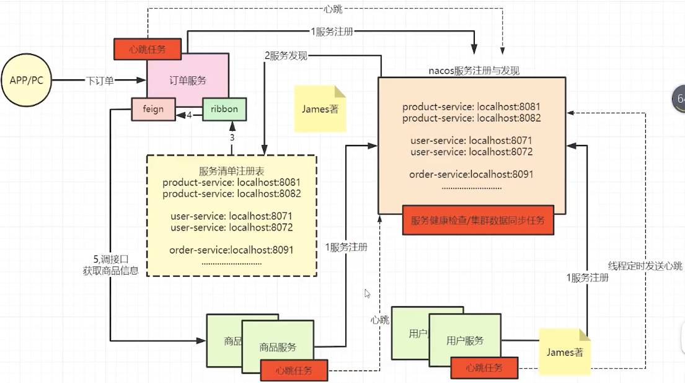
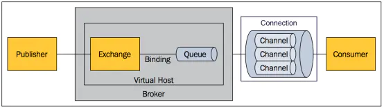
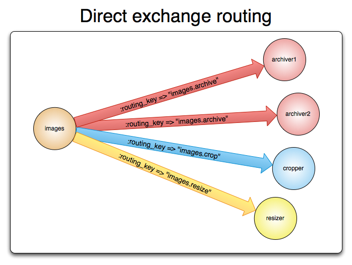
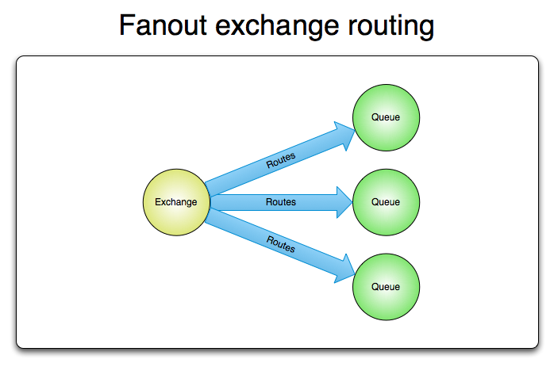

[TOC]

# 服务注册与发现、服务调用

## 相关框架及其联系

|   名称    | 提供者及目前状态 |                 定位                 |                             特性                             |
| :-------: | :--------------: | :----------------------------------: | :----------------------------------------------------------: |
|  Ribbon   |     Netflix      | IPC（Inter-Process Communication）库 | 负载均衡、容错、异步和响应式模型中支持多种协议（HTTP, TCP, UDP）、有caching和batching |
|   Feign   | Netflix（停更）  |   RPC（Remote Procedure Call）框架   | 消费端调用远程服务，简化http调用，内置Ribbon，不支持Spring MVC注解，基于http协议不适合高并发 |
| OpenFeign |      Spring      |                 同上                 |           Spring扩展版Feign，支持了Spring MVC注解            |
|   Dubbo   |     Alibaba      |                 同上                 |                 基于Netty，长连接适合高并发                  |
|  Eureka   | Netflix（停更）  |                                      |                                                              |
|   Nacos   |     Alibaba      |                                      |                                                              |

## 负载均衡

### 负载均衡策略

#### 基于随机的负载均衡

##### 完全随机

最简单的负载均衡，倒霉的情况下可能都压在一个服务器上。

##### 加权随机

为不同服务器添加权重，权重大的被随机到的概率大。

##### 改进加权随机

同样每个服务器带权重，随机一个随机数，从第一个服务器遍历直到找出一个权重大于等于随机数的服务器。

#### 基于轮询的负载均衡

##### 轮询 *Round Robin*（Ribbon默认负载均衡策略）

收到的请求循环分配到集群中的每台机器。


* 优点：简单有效；
* 缺点：如果每台机器性能不均，性能差的机器会超载。

##### 加权轮询 *Weighted Round Robin*


为不同机器分配权重，按权重分配给机器任务，任务有可能都到达同一个机器。如A的权重为3，B的权重为2的情况下：A -> A -> A -> B -> B -> ...。

* 优点：解决了轮询方式弱者超载的缺陷；
* 缺点：一定时间内的连接数无法确定，可能出现连接较少但超载的情况（比如连接处理时间较长）。

##### 平滑加权轮询 *Smoothed Weighted Round Robin*

在加权轮询$w_i$的基础上，添加动态权重$w'_i$，初始所有机器动态权重$w'_i=0$；当来了请求后按固定权重与动态权重之和寻找机器$i=\mathop{\arg\max}\limits_{i}(w_i+w'_i)$，并把选中机器的动态权重修改为当前动态权重与固定权重和之差$w'_i=w'_i-\sum{w_j}$，同时将全部机器的动态权重调整为$W'=W'+W$。


#### 基于连接数的负载均衡

##### 最小连接数 *Least Connection*

为了解决连接少但耗时长的请求，可以通过检测每个机器的当前连接数来分配任务，连接数最少的会自动接收下一个任务。

##### 加权最小连接 *Weighted Least Connection*

同时借鉴了权重与连接数的优势来实现负载均衡。

#### 源IP哈希/一致性哈希 *Source IP Hash*

对于来自同一个客户端的请求，通过对源IP进行求HashCode来达到同一个客户端的请求分配到固定服务器的目的。但这种方式也有可能造成资源分配不均（某个请求大户一直在发请求，但只有一个机器能应答）。

为了避免HashCode计算范围过大，可以采用哈希环的方式：哈希值在$[IP1,IP2)$时选择IP2服务器，哈希值在$[IP2,IP3)$时选择IP3服务器，哈希值在$[IP3,IP4)$时选择IP4服务器，哈希值在$[IP4,IP1)$时选择IP1服务器；当哈希环中有节点失效时，可以在失效节点内添加虚拟节点再把哈希环平分到几个节点。


### 不同框架下的负载均衡

#### Ribbon/Feign/OpenFeign

```yaml
ribbon:
  NFLoadBalancerRuleClassName: com.netflix.loadbalancer.RandomRule # 随机
  NFLoadBalancerRuleClassName: com.netflix.loadbalancer.RoundRobinRule # 轮询（默认）
  NFLoadBalancerRuleClassName: com.netflix.loadbalancer.RetryRule # 重试
  NFLoadBalancerRuleClassName: com.netflix.loadbalancer.WeightedResponseTimeRule # 加权响应时间
  NFLoadBalancerRuleClassName: com.netflix.loadbalancer.BestAvailableRule # 最小连接

```

## Nacos



### 服务注册与发现

#### 工作流程

微服务将自身注册到nacos服务注册列表，里面包含了微服务ID、微服务host、微服务port，心跳机制使用`@EnableScheduling`实现；有服务需要调用其他微服务时，使用OpenFeign的`@FeignClient`进行服务发现，使用Ribbon的`@LoadBalancer`进行负载均衡

### 网关管理

# NOSQL

## Redis

* 包含数据类型：string字符串、hash散列、list列表、set集合、zset有序集合；
* 使用C语言编写，数据是基于内存的，支持持久化（重启也会重新加载到内存），单线程，默认无密码，不分用户；
* 默认端口号：**6379**；
* 默认**16**个Redis实例，可以修改配置文件修改。

### 缓存问题

#### 缓存穿透

* 问题：key在Redis中根本不存在，直接访问数据库；
* 解决：布隆过滤器，一定不存在的被拦截。

#### 缓存击穿

* 问题：某个经常被访问的key（热点数据）过期，产生大量数据库读取操作；
* 解决：使用互斥锁挡住后续请求，自身访问数据库并写会缓存，由于锁被挡住的请求自己进入等待；

#### 缓存雪崩

* 问题：大量key在同一时刻过期，请求全部转到数据库；
* 解决：使用锁或队列，保证单线程写/失效时间分散。

### Redis持久化

为了解决内存数据丢失，使用持久化功能**RDB** *Redis DataBase*和**AOF** *Append Only File*将数据保存到硬盘，重启Redis时把硬盘的数据重新加载到内存，在redis.confz中修改默认策略。

#### RDB（默认）

指定时间间隔内，Redis执行了一定次数的写操作，自动触发一次持久化操作。

* 默认RDB策略：**15min内1次**；**5min内10次**；**1min内10000次**；
* stop-writes-on-bgsave-error：快照操作出错时停止写入磁盘，保证内存与硬盘的数据一致性；
* rdbcompression：是否使用LZF算法进行压缩；
* rdbchecksum：存储快照后CRC64算法校验数据；
* dbfilename：RDB持久化的文件名，默认**dump.rbd**；
* dir：RDB持久化文件保存的目录，默认**./**。

#### AOF

为了避免RDB最后几次操作丢失，AOF使用操作日志记录Redis的每一次写操作，下次启动Redis时全部重新执行写操作。

* appendfilename：AOF持久化文件名；

* appendfsync：AOF异步持久化策略

  *always*：每次数据变化都立刻写入硬盘；

  *everysec*：默认，每秒记录1次；

  *no*：由操作系统决定。

* no-appendfsync-on-rewrite：重写时是否使用appendfsync，默认不使用；

### Redis事务（部分原子性）

`multi`开启事务队列，后续所有命令都进入这一事务队列，`exec`启动事务队列中的命令，`discard`清空事务队列并结束，`watch <key>`/`unwatch <key>`监控/放弃监控某个key来实现CAS。

* 原子性

  进入事务队列过程中的命令出错，所有队列命令不执行，满足原子性；

  进入事务队列过程没出错，执行过程出错，错误行受影响，不满足原子性；

### Redis淘汰策略

#### 定期删除

默认每隔100ms随机抽取设置过expire的key，如果过期就删除；之所以使用随机，是为了避免CPU负载。

#### 惰性删除

从来没有被定期删除的key，只有被查询过，知道key已过期，才会被删除。

#### 内存淘汰机制

为了解决定期删除+惰性删除造成内存被占用，在配置文件中声明maxmemory来限制内存使用量（0为无限制），当达到了maxmemory时，进行内存淘汰：

* no-eviction：写入报错，不会删除数据（Redis默认内存淘汰机制）；
* volatile-lru：过期的数据中LRU淘汰；
* volatile-lfu：过期的数据中最不经常使用的淘汰；
* volatile-random：过期的数据中任选淘汰；
* volatile-ttl：选择将要过期的淘汰；
* allkeys-lru：所有数据中LRU淘汰；
* allkeys-lfu：所有数据中LFU淘汰；
* allkeys-random：所有数据中随机淘汰。

### Redis集群

#### 主从复制

master进行写操作并复制到slave，slave进行读操作，读写分离；查看主从关系：`info replication`；master可以有多个slave，slave还可以有自己的slave，每次写操作都是自动同步的。

* 绑定

  slave执行命令`slaveof <master-host> <master-port>`即可绑定到master；

* 解绑

  `salveof no one`；

* master宕机/重启

  slave不受影响，可以继续读；

* slave宕机/重启

  重启后不再是slave，需要重新绑定到master。

#### 哨兵模式

监控master，master挂掉立刻找一个slave成为新master，新加入的自动成为master的slave：

1. 创建配置文件<u>sentinel.conf</u>：

   ```shell
   sentinel monitor <sentinel-name> <master-host> <master-port> <poll-num>
   ```

2. 启动哨兵监控：`redis-sentinel <sentinel-conf-file>`。

#### 集群

### Redis消息发布与订阅

* `subscribe <channel>`订阅一个`<channel>`或以上频道的信息；
* `publish <channel> <context>`发布消息`<context>`到指定频道`<channel>`。

### Redis数据类型

* string：默认最大512M，可以存储任何类型的数据（二进制、JSON、序列化数据等）；
* list：按插入顺序排序，底层为双向链表；
* set：无序不重复集合；
* hash：适合存储POJO；
* zset：根据分数排序的不重复集合。

### Redis相关命令

#### 服务相关

* 启动服务：`redis-server &`，关闭服务：`redis-cli shutdown`；
* 进入客户端：`redis-cli`（相当于`mysql`）;
* 切换数据库实例：`select <index>`，默认0～15；
* 数据库实例条目数：`dbsize`，数据库实例中全部key：`keys *`；
* 清空数据库实例：`flushdb`/`flushall`。

#### key相关

* 查找key：`keys <pattern>`，pattern可以用`*`代表0或多个字符，`?`代表1个字符，`[]`代表1个正则表达式字符；
* 删除key：`del <key>`，返回删除数量，多个key用空格分隔；
* 是否存在key：`exists <key>`，多个key用空格分隔；
* 查找key的类型：`type <key>`；
* 移动key的数据到其他数据库实例：`mv <key> <index>`；
* 重命名key：`rename <oldKey> <newKey>`；
* **设置生存时间**：`expire <key> <seconds>`；
* 剩余生存时间：`ttl <key>`，-1永久，-2不存在。

# 消息队列

## 消息队列概念

### 业务问题模型

无消息队列的方案：假设某个业务涉及到了支付、短信通知、邮件通知三个子业务，如果不使用消息队列，需要等待$(100+200+300)ms$；如果需要增加子业务，这个时间还会更长并且需要修改整体业务代码


使用消息队列：主业务完成后，不着急的任务可以放在消息队列之后慢慢处理，全部业务完成虽然仍需$(100+200+300)ms$，但在这个过程中下单业务完成后用户可以进行其他操作（<u>后续操作就成了异步操作</u>），如果需要增加子业务可以增加到消息队列之后成为子项目（<u>业务解耦</u>），最耗时或浪费资源的任务可以后面慢慢处理（<u>高并发情况下系统不崩，削峰</u>）


## 消息队列好处

* 异步
* 解耦
* 削峰

## Kafka

分布式的基于发布/订阅模式的消息队列。

### 

## RabbitMQ

### 使用docker安装

1. 新建*docker-compose.yml*文件并写入以下内容

   ```yml
   rabbitmq:
     image: rabbitmq:management
     ports:
       - "5672:5672"
       - "15672:15672"
   ```

2. 在同级目录下的terminal中运行命令`docker-compose up`
3. 在本地terminal中运行命令`docker exec -it <imageId> bash`进入RabbitMQ的terminal
4. 添加用户命令：`rabbitmqctl add_user <username> <password>`（默认用户账号名与密码为*guest*）
5. 添加管理员权限：`rabbitmqctl set_user_tags <username> administrator`
6. 浏览器URL：http://localhost:15672，查看RabbitMQ相关情况


### AMQP模型 *Advanced Message Queue Protocol*



1. Publisher：消息生产者；
2. Exchange：交换器，接受生产者的消息并路由到服务器的队列中（类似于路由器）；
3. Binding：将消息队列和交换器关联起来的操作，基于路由规则绑定（类似于路由表）；
4. Queue：消息队列本体，保存消息到发送给消费者；
5. Connection：网络连接，如TCP连接；
6. Channel：信道，多路复用连接中的双向通道，建立在TCP上的虚拟连接；
7. Consumer：消息消费者；
8. Virtual Host：虚拟主机，表示一批交换器和消息队列（类似于文件夹，存放了交换器和消息队列文件）；
9. Broker：消息队列服务器实体（由多个文件夹构成的文件系统）。

### Exchange的类型

1. direct 单播模式（默认模式）

   生产者提供的消息包含`routing-key`，Exchange根据`routing-key`将消息发送到对应相同`binding-key`的队列；如果没有对应的`binding-key`，消息将丢失；

   

2. fanout 多播模式

   将消息发送到所有绑定的队列中，不涉及到`routing-key`所以很快；如果后加入的队列，收不到前面发送过的消息；

   

3. topic 订阅模式

   Exchange根据`routing-key`将消息发送到满足`binding-key`的队列；匹配规则：在绑定队列时，`binding-key`的值格式为`aa.bb.cc...`，则`aa.*`只能匹配到`aa.xx`（仅仅下一级）；`aa.#`可以匹配到`aa`、`aa.xx`或`aa.xx.yy`等（下面多级）。

### 事务管理

#### 生产者端

RabbitMQ中的事务是在Channel中的，通过`channel.txSelect()`开启事务，并需要使用`channel.txCommit()`提交，在错误处理中调用`channel.txRollback()`进行回滚并`channel.close()`释放内存。

#### 消费者端

