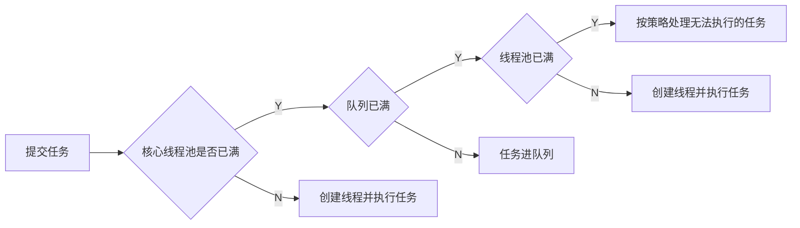
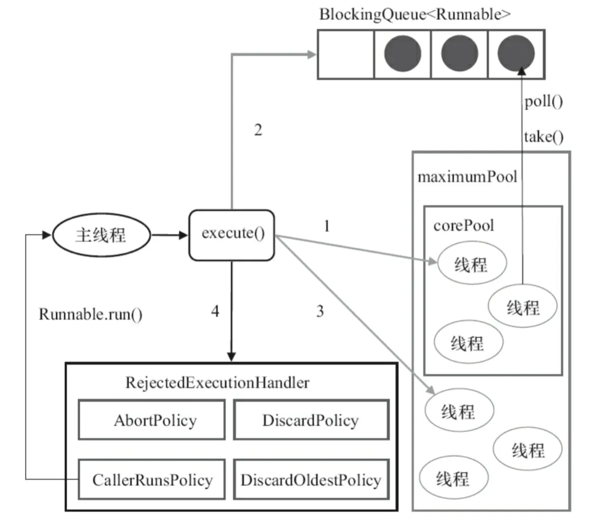
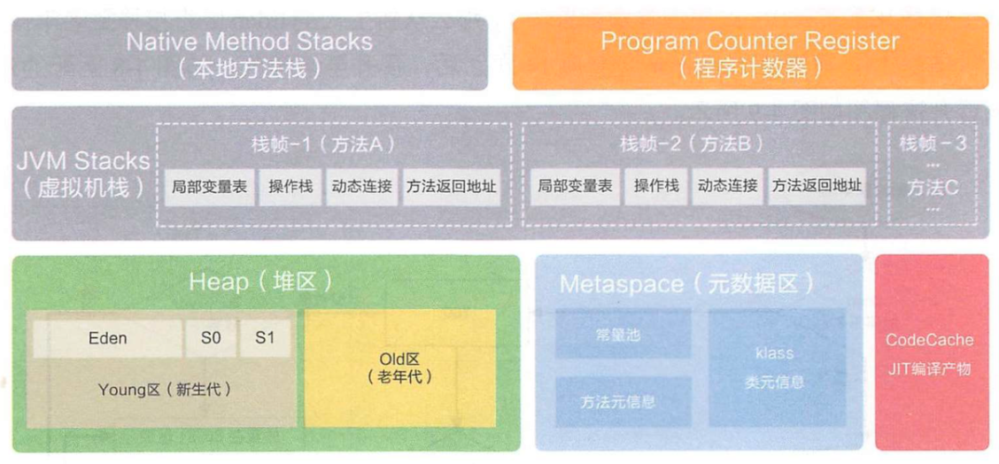
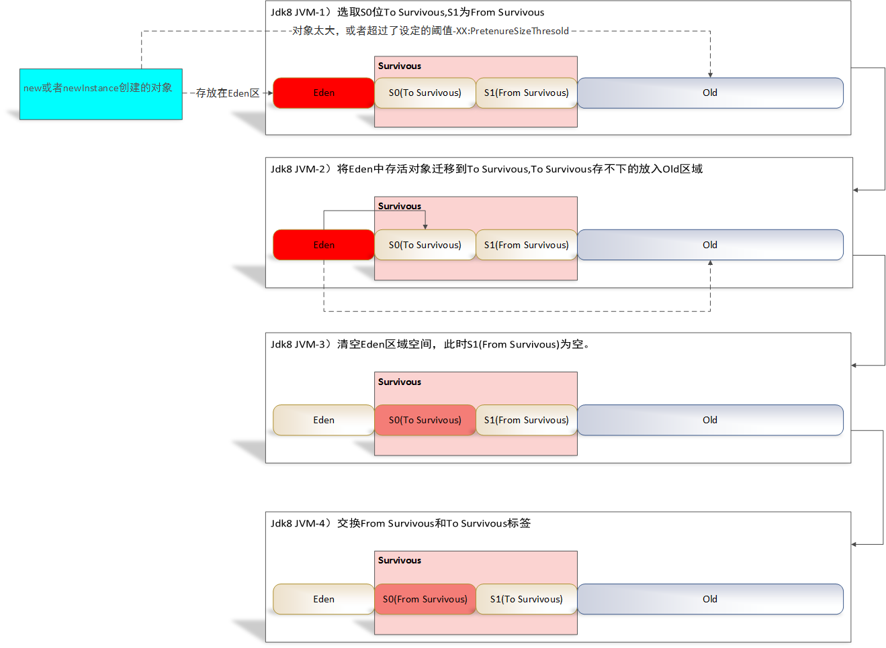

[TOC]

# 并发相关

## 线程池

### 目的

* 利用多线程压榨CPU算力；
* 降低创建、销毁线程过程的CPU开销与GC压力；
* 提高任务响应速度，无需等待线程创建；
* 限制线程数量并可以进行统一的分配、调优和监控。

### 使用流程

其中`corePool`是核心线程池，`blockQueue`是队列，`maximumPool`是线程池，`rejectedExecution Handler`是拒绝策略。

### `Executors`包内实现的`ExecutorService`

* `newFixedThreadPool`：使用`LinkedBlockingQueue`，线程池长度通过参数固定，没达到指定数量前会继续创建线程，**队列不限长度**，`maxpoolsize`与`keepalive`参数无效，线程空闲时按**FIFO调度**，不空闲时进入队列；
* `newWorkStealingPool`：
* `newSingleThreadExecutor`：同样使用`LinkedBlockingQueue`，**线程池中只有一个线程**，队列不限长度，线程空闲时按FIFO调度，不空闲时进入队列；
* `newCachedThreadPool`：使用`SynchronousQueue`，**核心线程池长度为0**，**队列需要插入元素前必须有另一个线程从这个队列消耗元素**；
* `newScheduledThreadPool`：使用`DelayQueue`，**提交的任务按时间为优先级进入阻塞队列**，线程只能从队列获取任务。

### 相关参数

* `corePoolSize`：当使用了`LinkedBlockingQueue = new LinkedBlockQueue`的时候，队列长度默认无限长，会导致线程数量永远等于`corePoolSize`，任务激增时任务响应时间也激增；
* `maxPoolSize`：线程池中线程个数，增加线程的公式：$(任务数-queueCapacity) \times (原线程数 \div 原任务数)$；
* `keepAliveTime`：线程最大（空闲）存活时间；
* `rejectedExecutionHandler`：线程被拒绝的解决方案，可以自己重写。

## `volatile`与`synchronized`

### 底层实现

## `ThreadLocal`相关

### `ThreadLocal`造成内存泄漏

`ThreadLocalMap`的key为**弱引用**，value为**强引用**，有可能造成key被GC，value没被GC，`ThreadLocalMap`中出现`null`为key的`Entry`，产生内存泄漏；

解决方式：调用`set()`、`get()`和`remove()`方法时，会清理掉key为`null`的记录，使用`ThreadLocal`方法后手动`remove()`。

# JVM相关

## 栈的种类

* JVM栈

  包括了**操作数栈**、局部变量表、指向当前方法所属类的运行时常量池的**引用**、方法**返回地址**；

* 本地方法栈

  非Java语言实现的方法。

## 堆中都有什么

线程共享的内存区域，所有实例化的对象保存在堆中，是垃圾回收GC的执行空间

## GC过程

## 判断对象是否需要被回收

* 引用计数：有地方引用该对象，计数器++，引用失效，计数器--，有循环引用的问题；
* 可达性分析：根据引用的关系构造引用链（有向图），在图中不可达的对象就是要被回收的。

# 持久层相关

## Redis

## MySQL

### 防止SQL注入

### B树与B+树

B树：

* 索引与数据存储在每个节点中；
* 搜索过程有可能在非叶子节点结束（最好情况下$O(1)$）。

B+树：

* 所有数据存储在叶子节点中；
* 所有叶子节点被双向链连接；
* 搜索过程固定时间复杂度（$O(\log n)$）；
* 适合范围查找，降低磁盘IO次数。

### 优化查询速度

#### 索引建立准则

#### 索引失效

1. `like`左模糊查询；
2. `where`进行了运算/函数；
3. `<>`/`!=`/`not in`等查找；
4. `or`查询索引列在非索引列后面。

#### `explain`方法

使用`explain <SELECT语句>`进行查询过程执行情况，可以参考[这里](https://www.cnblogs.com/xuanzhi201111/p/4175635.html)，相关输出参数如下：

|     名称     |             含义             |
| :----------: | :--------------------------: |
|      id      | 含子查询的情况下，递归的深度 |
| select_type  |       select语句的类型       |
|    table     |          涉及到的表          |
|     key      |     **实际使用到的索引**     |
| possible_key |        可以使用的索引        |

#  框架相关

## 消息队列

## 服务注册与发现

### Nacos底层协议

## 负载均衡

## Spring

### REST风格接口

# 数据结构与算法相关

## 手撸HashMap

代码[见此](https://github.com/AlbertoWang/java-noob/blob/master/src/cn/albertowang/datastructure/hashmap/HashMap.java)。

## 多数据求TopK

维护一个堆，详细可见[这里](https://github.com/AlbertoWang/java-noob/blob/master/src/cn/albertowang/datastructure/heap/Heap.java)。

## AVL树与红黑树

# 操作系统

## 死锁的条件

1. 互斥：一个资源只能给一个进程使用；
2. 占有并等待：进程持有资源并申请新资源，在申请到需要的资源之前，已有的资源不释放；
3. 不可剥夺：进程申请到的资源在使用完之前，不可以被其他进程使用；
4. 循环等待：各个进程的资源请求形成首尾连接循环等待。

## 线程与进程的区别

## 进程间通信的方式

# 计算机网络

## TCP粘包

## TCP建立连接与断开连接

可以参考[这里](https://github.com/AlbertoWang/java-noob/blob/master/%E8%AE%A1%E7%AE%97%E6%9C%BA%E7%BD%91%E7%BB%9C.md)。

## 基于TCP协议的应用层协议

## `ping`命令过程

1. 域名在DNS服务器查找IP地址；
2. 通过Ping程序发送**ICMP包；**
3. 同一网段的情况下，调用IP层的**ARP协议**请求**广播**（不同网段的情况下，交给路由器处理），查找目标主机的MAC地址；
4. 目标主机ARP协议收到请求后，将本机**MAC地址填充**并**发送ARP应答**回到请求发送方；
5. 请求发送方发送**ICMP数据**到目标主机；
6. 目标主机**响应ICMP包**；
7. 请求主机收到目标主机的**ICMP响应包**。

# 开放问题

## Linux常用命令

* 搜索进程ID：`ps -ef | grep <进程名>`，`-e`相当于`-a`是全部列出，`-f`是显示UID等；

## 智力题

1. 两个人抛硬币，先抛到正面的赢。先手赢的概率？（$\frac{1}{2}+(\frac{1}{2})^3+(\frac{1}{2})^5+...+(\frac{1}{2})^n=\frac{2}{3}$）
2. 一次上一个台阶或两个台阶，上$n$个台阶有多少种上法？（斐波那契数列，$f(n)=f(n-1)+f(n-2)$）
3. 