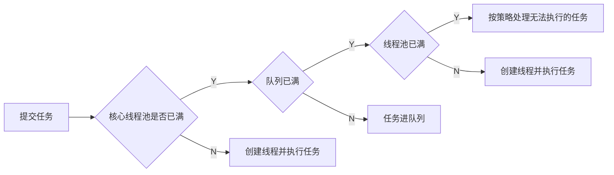

[TOC]

# 并发相关

## 线程池

### 目的

* 利用多线程压榨CPU算力；
* 降低创建、销毁线程过程的CPU开销与GC压力；
* 提高任务响应速度，无需等待线程创建；
* 限制线程数量并可以进行统一的分配、调优和监控。

### 使用流程

其中`corePool`是核心线程池，`blockQueue`是队列，`maximumPool`是线程池，`rejectedExecution Handler`是拒绝策略。

### `Executors`包内实现的`ExecutorService`

* `newFixedThreadPool`：使用`LinkedBlockingQueue`，线程池长度通过参数固定，没达到指定数量前会继续创建线程，**队列不限长度**，`maxpoolsize`与`keepalive`参数无效，线程空闲时按**FIFO调度**，不空闲时进入队列；
* `newWorkStealingPool`：
* `newSingleThreadExecutor`：同样使用`LinkedBlockingQueue`，**线程池中只有一个线程**，队列不限长度，线程空闲时按FIFO调度，不空闲时进入队列；
* `newCachedThreadPool`：使用`SynchronousQueue`，**核心线程池长度为0**，**队列需要插入元素前必须有另一个线程从这个队列消耗元素**；
* `newScheduledThreadPool`：使用`DelayQueue`，**提交的任务按时间为优先级进入阻塞队列**，线程只能从队列获取任务。

### 相关参数

* `corePoolSize`：当使用了`LinkedBlockingQueue = new LinkedBlockQueue`的时候，队列长度默认无限长，会导致线程数量永远等于`corePoolSize`，任务激增时任务响应时间也激增；
* `maxPoolSize`：线程池中线程个数，增加线程的公式：$(任务数-queueCapacity) \times (原线程数 \div 原任务数)$；
* `keepAliveTime`：线程最大（空闲）存活时间；
* `rejectedExecutionHandler`：线程被拒绝的解决方案，可以自己重写。

## 线程同步相关

### `synchronized`底层实现

同步代码块使用了底层原语的monitorenter和monitorexit，同步方法使用ACC_SYNCHRONIZED。

每个对象拥有一个monitor，monitor只能被一个线程拥有（monitor的进入数为0则可进，进入后变为1，monitor进入数为1则不允许其他线程进入），是可重入的；其他线程申请进入monitor只能等待进入数变为0；

拥有monitor的线程才可以执行monitorexit，进入数会-1，降到0时释放monitor（以上过程与AQS类似）

### `synchronized`锁升级

JDK1.6之后对`synchronized`进行了优化，锁可以逐步升级（无锁 -> 偏向锁 -> 轻量级锁 -> 重量级锁）：

* 偏向锁：适用于单线程，过程与AQS类似；
* 轻量级锁：不会阻塞，执行速度快，但得不到锁单线程进行自旋耗费CPU；
* 重量级锁：阻塞，执行时间长，但不会消耗CPU。

## `ThreadLocal`相关

### `ThreadLocal`造成内存泄漏

`ThreadLocalMap`的key为**弱引用**，value为**强引用**，有可能造成key被GC，value没被GC，`ThreadLocalMap`中出现`null`为key的`Entry`，产生内存泄漏；

解决方式：调用`set()`、`get()`和`remove()`方法时，会清理掉key为`null`的记录，使用`ThreadLocal`方法后手动`remove()`。

# JVM相关

## 栈的种类

* JVM栈

  包括了**操作数栈**、局部变量表、指向当前方法所属类的运行时常量池的**引用**、方法**返回地址**；

* 本地方法栈

  非Java语言实现的方法。

## 堆中都有什么

线程共享的内存区域，所有实例化的对象保存在堆中，是垃圾回收GC的执行空间

## GC过程

## 判断对象是否需要被回收

* 引用计数：有地方引用该对象，计数器++，引用失效，计数器--，有循环引用的问题；
* 可达性分析：根据引用的关系构造引用链（有向图），在图中不可达的对象就是要被回收的。

# 持久层相关

## Redis

### Redis的原子性

### Redis常用数据结构

## MySQL

### 防止SQL注入

### 事务隔离级别

1. *Read Uncommitted*

   事务正在访问数据并产生修改，但还没提交到数据库中，若另一个事务也访问了该数据，这个数据就成为脏数据，即第二个事务发生了**脏读**；

2. *Read Committed* （SQL Server和Oracle默认隔离界别）

   事务只能读到其他事务已经提交的数据（解决了**脏读**），但如果在读的过程中，另一个事务将数据修改并提交，第一个事务再次读这个数据的时候就会发现不一致，即第一个事务发生了**不可重复读**；

3. *Repeated Read* （MySQL默认隔离级别）

   事务进行中，其他事务不能修改第一个事务使用中的数据（解决了**脏读**和**不可重复读**），但如果第一个事务进行中，另一个事务新增/删除了一条数据，有可能会影响第一个事务的数据，即第一个数据发生了**幻读**；

4. *Serializable*

   事务串行化按序执行（解决了**脏读**、**不可重复读**和**幻读**），但效率差开销高。

### B树与B+树

B树：

* 索引与数据存储在每个节点中；
* 搜索过程有可能在非叶子节点结束（最好情况下$O(1)$）。

B+树：

* 所有数据存储在叶子节点中；
* 所有叶子节点被双向链连接；
* 搜索过程固定时间复杂度（$O(\log n)$）；
* 适合范围查找，降低磁盘IO次数。

### 聚簇索引与非聚簇索引

### 优化查询速度

#### 索引建立准则

#### 索引失效

1. `like`左模糊查询；
2. `where`进行了运算/函数；
3. `<>`/`!=`/`not in`等查找；
4. `or`查询索引列在非索引列后面。

#### `explain`方法

使用`explain <SELECT语句>`进行查询过程执行情况，可以参考[这里](https://www.cnblogs.com/xuanzhi201111/p/4175635.html)，相关输出参数如下：

|     名称     |             含义             |
| :----------: | :--------------------------: |
|      id      | 含子查询的情况下，递归的深度 |
| select_type  |       select语句的类型       |
|    table     |          涉及到的表          |
|     key      |     **实际使用到的索引**     |
| possible_key |        可以使用的索引        |

#  框架相关

## 消息队列

## 服务注册与发现

### Nacos底层协议

### 服务注册表的存储

### 服务下线感知

## 负载均衡

### Ribbon默认负载均衡机制

采用轮询的方式。

## Spring

### 动态代理

Spring的AOP使用**动态代理**实现，动态代理的实现有<u>基于interface的JDK动态代理</u>和<u>基于extends的CGLib动态代理</u>；

### REST风格接口

# 数据结构与算法相关

## 手撸快排

代码[见此]()。

## 手撸HashMap

代码[见此](https://github.com/AlbertoWang/java-noob/blob/master/src/cn/albertowang/datastructure/hashmap/HashMap.java)。

## 多数据求TopK

维护一个堆，详细可见[这里](https://github.com/AlbertoWang/java-noob/blob/master/src/cn/albertowang/datastructure/heap/Heap.java)。

## AVL树与红黑树

# 操作系统

## 死锁的条件

1. 互斥：一个资源只能给一个进程使用；
2. 占有并等待：进程持有资源并申请新资源，在申请到需要的资源之前，已有的资源不释放；
3. 不可剥夺：进程申请到的资源在使用完之前，不可以被其他进程使用；
4. 循环等待：各个进程的资源请求形成首尾连接循环等待。

## 线程与进程的区别

## 进程间通信的方式

# 计算机网络

## TCP粘包

## TCP建立连接与断开连接

可以参考[这里](https://github.com/AlbertoWang/java-noob/blob/master/%E8%AE%A1%E7%AE%97%E6%9C%BA%E7%BD%91%E7%BB%9C.md)。

## 基于TCP协议的应用层协议

## `ping`命令过程

1. 域名在DNS服务器查找IP地址；
2. 通过Ping程序发送**ICMP包；**
3. 同一网段的情况下，调用IP层的**ARP协议**请求**广播**（不同网段的情况下，交给路由器处理），查找目标主机的MAC地址；
4. 目标主机ARP协议收到请求后，将本机**MAC地址填充**并**发送ARP应答**回到请求发送方；
5. 请求发送方发送**ICMP数据**到目标主机；
6. 目标主机**响应ICMP包**；
7. 请求主机收到目标主机的**ICMP响应包**。

# 开放问题

## Linux常用命令

* 搜索进程ID：`ps -ef | grep <进程名>`，`-e`相当于`-a`是全部列出，`-f`是显示UID等；
* 任务管理器：`top`；
* 内存使用情况：`free -m`；
* 统计：`wc`；
* 修改用户权限：`chmod`；

## 代码题

* [快排/递归方式的排序](https://www.nowcoder.com/practice/2baf799ea0594abd974d37139de27896?tpId=117&tqId=37851&companyId=139&rp=1&ru=%2Fcompany%2Fhome%2Fcode%2F139&qru=%2Fta%2Fjob-code-high%2Fquestion-ranking&tab=answerKey)；
* [上台阶/斐波那契数列](https://www.nowcoder.com/practice/8c82a5b80378478f9484d87d1c5f12a4?tpId=117&tqId=37764&companyId=139&rp=1&ru=%2Fcompany%2Fhome%2Fcode%2F139&qru=%2Fta%2Fjob-code-high%2Fquestion-ranking&tab=answerKey)；
* [实现LRU](https://www.nowcoder.com/practice/e3769a5f49894d49b871c09cadd13a61?tpId=117&tqId=37804&companyId=139&rp=1&ru=%2Fcompany%2Fhome%2Fcode%2F139&qru=%2Fta%2Fjob-code-high%2Fquestion-ranking&tab=answerKey)；
* [二叉树之字遍历](https://www.nowcoder.com/practice/47e1687126fa461e8a3aff8632aa5559?tpId=117&tqId=37722&companyId=139&rp=1&ru=%2Fcompany%2Fhome%2Fcode%2F139&qru=%2Fta%2Fjob-code-high%2Fquestion-ranking&tab=answerKey)/[层序遍历](https://www.nowcoder.com/practice/04a5560e43e24e9db4595865dc9c63a3?tpId=117&tqId=37723&companyId=139&rp=1&ru=%2Fcompany%2Fhome%2Fcode%2F139&qru=%2Fta%2Fjob-code-high%2Fquestion-ranking&tab=answerKey)；
* [链表是否有环](https://www.nowcoder.com/practice/650474f313294468a4ded3ce0f7898b9?tpId=117&tqId=37714&companyId=139&rp=1&ru=%2Fcompany%2Fhome%2Fcode%2F139&qru=%2Fta%2Fjob-code-high%2Fquestion-ranking&tab=answerKey)；
* [括号匹配](https://www.nowcoder.com/practice/37548e94a270412c8b9fb85643c8ccc2?tpId=117&tqId=37749&companyId=139&rp=1&ru=%2Fcompany%2Fhome%2Fcode%2F139&qru=%2Fta%2Fjob-code-high%2Fquestion-ranking&tab=answerKey)；
* 数字序列，除了一个元素外，其他元素都出现了两次，找到出现一次的元素（使用位运算）；
* 链表从后向前遍历，每k个编入一组（使用栈）；
* 

## 智力题

1. 两个人抛硬币，先抛到正面的赢。先手赢的概率？（$\frac{1}{2}+(\frac{1}{2})^3+(\frac{1}{2})^5+...+(\frac{1}{2})^n=\frac{2}{3}$）
2. 一次上一个台阶或两个台阶，上$n$个台阶有多少种上法？（斐波那契数列，$f(n)=f(n-1)+f(n-2)$）
3. 