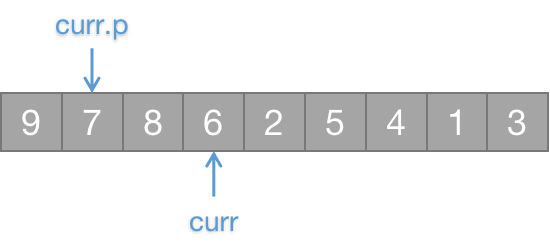

[TOC]

# 数据结构

## 哈希表 *HashTable*

### Hash冲突解决

### 开放地址

$H_i = (H(key)+d_i) \% m$，其中$H()$为哈希函数，$m$为哈希表表长：

* 线性探测再散列：$d_i \in \{1, 2, ..., m-1\}$，每次遇到冲突在$d_i$序列向后找；
* 二次探测再散列：$d_i \in \{1^2, -(1)^2, 2^2, -(2^2),..., k^2, -(k^2)\}$，每次遇到冲突在$d_i$序列向后找；
* 随机探测再散列：$d_i$随机。

### 再哈希

发生冲突时，使用另外的哈希函数计算，直到不再冲突。

### 链地址

使用桶的方式，将冲突的$key$放在同一个桶对应的链表中（`HashMap`使用的方式）。

## 堆 *Heap*

堆是一种类似完全二叉树的数据结构，分为大顶堆和小顶堆。在大顶堆中，任意节点`node`满足`node >= node.left && node >= node.right`。

### 建堆过程（大顶堆）

#### 自底向上（叶子到根）

将序列$N$中的元素逐个放入堆$h$中，每次放入时调整堆$h$，让$h$始终处于满足大顶堆（小顶堆）条件的状态；为了调整堆，需要提供一个指向当前元素的指针`curr`与指向当前元素的父节点的指针`curr.p`，可以通过`curr.p = (curr-1)>>1`计算父节点指针。

代码实现在[这里](https://github.com/AlbertoWang/java-noob/blob/master/src/cn/albertowang/datastructure/heap/Heap.java)。

堆调整的时间复杂度为$O(\log n)$，整个建堆过程的时间复杂度为$O(n \log n)$。

1. 将序列首个元素作为堆顶（图中已进入堆的元素标记为灰色），`curr`后移，`curr.p = (curr-1)>>1`指向`curr`的父节点；

   

   

2. 迭代进行堆调整：判断`curr`与`curr.p`的值，如果`curr.p.val < curr.val`（父节点小于当前节点的值），置换`curr`与`curr.p`的值（图中标记为绿色），并且迭代更新`curr = curr.p`，`curr.p = (curr-1)>>1`循环上述迭代过程，直到`curr.p`指向堆顶；如果`curr.p.val >= curr.val`，跳过此次堆调整，继续添加新元素到堆内；

   

3. `curr`继续向后移动，同时保证`curr.p = (curr-1)>>1`，循环进行上述方法直到全部元素都已进入堆（图中标记为灰色）；循环过程：

   

   

   

   

   

   

   

   

   

   

   

   

   

   

   

   

   

4. 最终大顶堆如下，满足每个子树的根大于等于子树全部节点：

   

#### 自顶向下（根到叶子）

设置一个指针`curr`二分遍历序列，每次遍历时，将`curr`与其左右子节点`left`与`right`相比，若有大于`curr`的子节点，将`curr`与该子节点置换，`curr`指向置换后的位置；若没有大于`curr`的子节点，`curr`向左子节点；当`curr`无左子节点时，`curr`指向堆顶，进行下一次遍历。

代码实现在[这里](https://github.com/AlbertoWang/java-noob/blob/master/src/cn/albertowang/datastructure/heap/Heap.java)。

1. 将`curr`指向序列第一个元素（堆顶），同时设置`left`与`right`指针；

   

2. 比较`left`、`right`与`curr`指向元素的值，将`curr.val`与`max(left.val, right.val)`置换（图中标记为绿色），并将`curr`指向置换位置，同时更新`left`与`right`；

   

   

3. 若`left`与`right`的值均小于`curr`对应的值，`curr`指向`curr`的左子节点；重复上述过程直到`left`超出序列空间，单次循环结束，将`curr`重新指向堆顶：

   

   

4. 循环上述过程：

   

   

   

   

   

   

   

   

   

### 堆应用

#### TopK算法

在长度为$n$的无序序列中找到最大（最小）的$k$个元素，时间复杂度为$O(n \log k)$，比排序快。

实现代码在[这里](https://github.com/AlbertoWang/java-noob/blob/master/src/cn/albertowang/datastructure/heap/Heap.java)。

1. 最大（最小）的$k$个元素，需要构造一个长度为$k$的小顶（大顶）堆；
2. 从第$k+1$个元素开始遍历序列，每次与小顶（大顶）堆堆顶元素比较，若大于（小于）堆顶元素，将其与堆顶元素交换，采用自顶向下的方法重新维护小顶（大顶）堆。

#### 堆排序

# 基本算法

## 排序

### 	快速排序

通过将序列$N$中的元素分为两部分$a \in A$与$b \in B$，满足条件$a<b$；将此过程递归进行得到有序序列。

快速排序最好的情况下时间复杂度为$O(n \log n)$，最坏情况下时间复杂度为$O(n^2)$，取决于`pivot`的选取（因此推荐随机取`pivot`）。

#### 基本流程

实现代码在[这里](https://github.com/AlbertoWang/java-noob/blob/master/src/cn/albertowang/algorithm/sort/quicksort/QuickSort.java)。

1. 选取一个`pivot`，`pivot`可以选序列中任意一个元素（这里选择最后一个元素为`pivot`），并设置两个指针`left`与`right`分别指向第一个与最后一个元素；

   

2. `left`右移，`right`左移，直到`left`找到第一个比`pivot`大的元素，`right`找到第一个比`pivot`小的元素，将`left`与`right`对应的元素交换（图中标记为绿色）；

   

   

3. 交换完毕后，继续执行步骤2，直到`left`与`right`相遇，将`left`与`right`对应的元素与`pivot`对应的元素进行交换（图中标记为橙色）；

   

   

4. 固定下来`pivot`对应的元素（图中标记为灰色），将序列以`pivot`所在位置分为左子序列与右子序列，并递归上述方法；

   

   

5. 递归过程：

   

   

   

   

   

   

   

   

#### 注意事项

* 循环停止条件：`left >= right`；
* `right`与`pivot`重合可以避免数组越界判断；
* 如果采用第一个元素为`pivot`的话，需要先移动`right`再移动`left`才可以保证顺序。

### 归并排序

#### 基本流程

#### 注意事项

# 编程题

## 常用数据结构与函数

### 列表

`List<T> list = new ArrayList<T>();`或`List<T> linkedList = new LinkedList<>(T);`

* 数组转为列表：`List<Integer> list = Arrays.stream(array).boxed().collect(Collectors.toList())`

  如果非可装箱类型需要去除`boxed()`；

* 列表转为数组：`int[] array = list.stream().mapToInt(Integer::intValue).toArray();`

  如果非可装箱类型可以直接`T[] array = list.toArray(new T[list.size()]);`。

### 队列

`Queue<T> queue = new LinkedList<T>();`

* `peek()`获取队列头；
* `offer(T t)`添加元素；
* `poll()`消费队列头并返回。

### 堆

`Queue<T> heap = new PriorityQueue<T>();`

默认小顶堆，如需使用大顶堆，使用lambda表达式声明`Comparator`：`Queue<T> maxHeap = new PriorityQueue<T>((t1, t2) -> t2 - t1) `；

基本使用方法与队列相同。

### 栈

`Stack<T> stack = new Stack<T>();`

* `search(T t)`查找目标，从1开始；
* `push(T t)`压栈；
* `pop()`出栈；
* `peek()`获取栈顶元素。

## 链表相关

### 反转链表

代码[在此](https://github.com/AlbertoWang/java-noob/blob/master/src/cn/albertowang/datastructure/linklist/ReverseLinkList.java)。

1. 设置当前节点指针`curr`，当前节点前序指针`pre`，当前节点后序指针`next`；

   

2. 按以下顺序调换指针：`curr.next = pre`；

   

3. `pre = next`；

   

4. `curr = next`；

   

5. 下一次循环时先确认`next = curr.next`。

   

### 链表分组反转

代码[在此](https://github.com/AlbertoWang/java-noob/blob/master/src/cn/albertowang/datastructure/linklist/ReverseKGroup.java)。

1. 为链表设置一个虚拟头节点`preHead`；

   

2. 找到当前处理子序列在整个序列中的前序节点`lastOfPre`与子序列的尾节点`lastOfThis`；

   

3. 找到当前处理子序列在整个序列中的后序节点`headOfNext`与子序列的头节点`headOfThis`；

   

4. 将子序列与后序序列断开；

   

5. 反转子序列链表；

   

   

6. `lastOfPre.next = lastOfThis`，前序节点的下一个指向反转后子序列的头节点；`headOfThis.next = headOfNext`，子序列的尾节点的下一个指向后序节点（由于子序列反转，`headOfThis`变成了尾节点，`lastOfThis`变成了头节点）；

   

7. `lastOfPre = headOfThis`、确定`lastOfThis`，`headOfThis = lastOfPre.next`、确定`headOfNext`，继续上述过程，直到`lastOfThis == null`。

   

