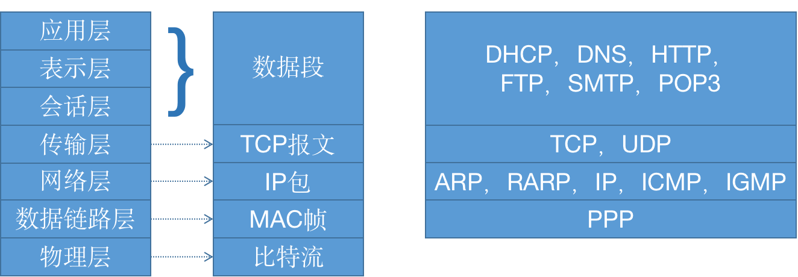
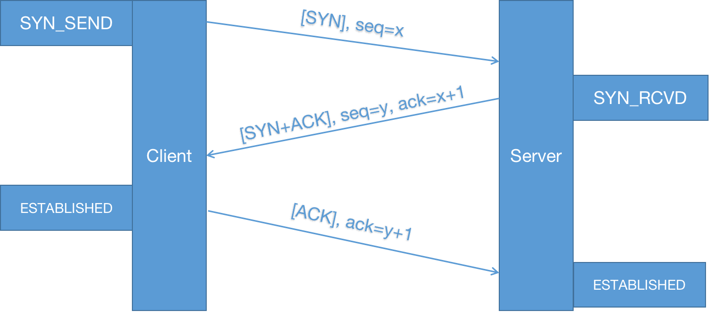
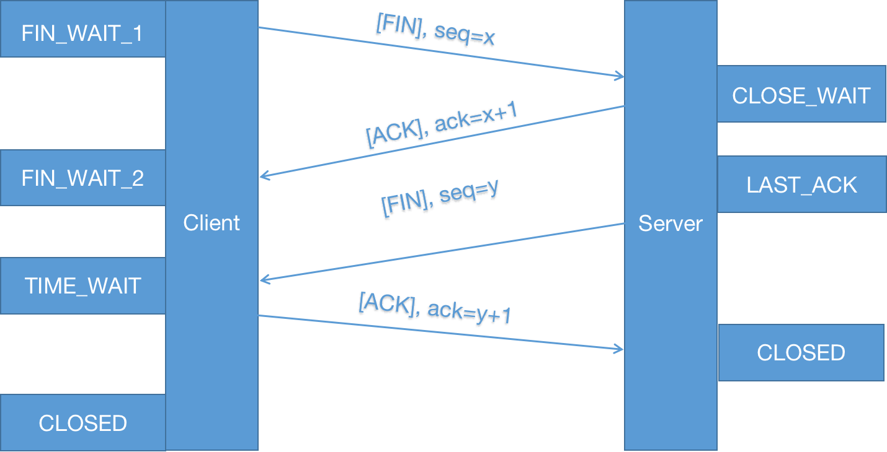

[TOC]

# 计算机网络模型概述

计算机OSI模型、各层数据、各层协议图：

## 各层协议简述

### 网络层

#### ARP：地址解析协议 *Address Resolution Protocol*

根据IP地址获取MAC地址。

#### RARP： 反向地址转换协议 *Reverse Address Resolution Protocol*

根据MAC地址获取IP地址。

#### ICMP：控制报文协议 *Internet Control Message Protocol*

主机、路由器之间传递控制消息，由IP提供服务。

#### IGMP：组管理协议 *Internet Group Management Protocol*

主机、组播路由器之间传递分组消息，由IP提供服务。

### 传输层

#### TCP：传输控制协议 *Transmission Control Protocol*

* 面向连接，可靠通信；
* 一对一；
* 头大（20字节）；
* 有流量、拥塞控制；
* 面向字节流。

#### UDP：用户数据报协议 *User Datagram Protocol*

* 无连接，快速；
* 一对一，一对多，多对多；
* 头小（8字节）；
* 网络拥堵不影响发送速率；
* 面向报文。

### 应用层

#### HTTP：超文本传输协议 *Hypertext Transfer Protocol*

基于Client/Server模式，面向连接。

#### DNS：域名系统 *Domain Name System*

将域名与IP一一映射的数据库。

#### DHCP：动态主机配置协议 *Dynamic Host Configuration Protocol*

自动获得分配的IP与子网掩码。

# 常考试题

## 传输层

### TCP建立连接与断开连接

#### 建立连接：三次握手

1. Client发起建立连接请求`[SYN]`，序列号`seq=x`，发送完进入`SYN_SEND`状态；
2. Server收到请求后，发送对应`ack=x+1`的应答`[ACK]`与`seq=y`的建立连接请求`[SYN]`，发送完进入`SYN_RCVD`状态；
3. Client收到请求后，发送对应`ack=y+1`的应答`[ACK]`并进入`ESTABLISHED`状态；
4. Server收到请求后，进入`ESTABLISHED`状态，TCP连接建立完成。

#### 断开连接：四次挥手

1. Client发送断开连接请求`[FIN]`，序列号`seq=x`，发送完进入`FIN_WAI_1T`状态；
2. Server收到请求后，发送对应`ack=x+1`的应答`[ACK]`，发送完进入`CLOSE_WAIT_1`状态，等待之前连接中传输中的数据传输完成；
3. Client收到请求后，进入`FIN_WAIT_2`状态，等待服务器发送关闭连接的请求；
4. Server传输完数据打算关闭连接时，发送断开连接请求`[FIN]`，序列号`seq=y`，发送完进入`LAST_ACK`状态等待Client的通知；
5. Client收到请求后，发送对应`ack=y+1`的应答`[ACK]`，发送完进入`TIME_WAIT`状态，等待Server可能继续发送的数据；
6. Server收到请求后，关闭连接并进入`CLOSED`状态；
7. Client在等待固定时间后，如果没收到Server的其他数据，说明Server已成功关闭连接，自己也进入`CLOSED`状态。

## 应用层

### 浏览器收到URL到展示页面的过程

1. DNS域名解析获取IP地址；
2. 建立TCP连接；
3. 发送HTTP请求；
4. Server处理请求并返回HTTP报文；
5. 浏览器解析渲染页面。

### HTTP协议与HTTPS协议

* HTTPS协议需要申请证书（由数字证书认证机构CA颁发），不能在同一IP地址上绑定多个域名；
* HTTPS工作流程：
  1. 建立TCP连接；
  2. Client验证Server的数字证书；
  3. 协商加密算法、密钥；
  4. SSL安全加密隧道协商完成；
  5. 网页以加密方式传输，对称加密保证加密，hash算法保证不被篡改数据。

|        |            HTTP            |                 HTTPS                 |
| :----: | :------------------------: | :-----------------------------------: |
| 安全性 |          明文传输          |             对称加密+hash             |
|  速度  | 快，只有TCP建立连接的3个包 | 慢，除了TCP连接包外还有SSL握手的9个包 |
|  端口  |             80             |                  443                  |

### 反向代理 *Reverse Proxy*

* 含义

  反向代理是指使用代理服务器接受请求，并将该请求转发给内部服务器，并将内部服务器的结果返回给发起请求的客户端，代理服务器对外表现为一台服务器。

* 负载均衡

  将外部请求动态转发给内部服务器达到负载均衡的目的。

* 缺点

  代理服务器需要建立两个连接（对外客户端和对内服务器），可能会成为瓶颈。